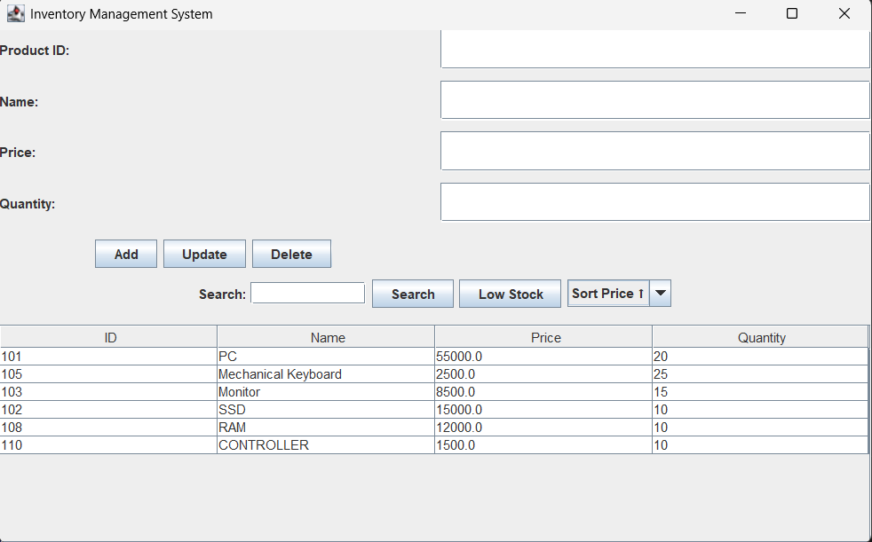

# CoreInventory

A Java-based Inventory Management System developed using Java and OOP concepts.

## Features
- Product Management
- Inventory Tracking
- Dashboard UI
- Stock Updates

## Technologies
- Java
- Swing
- OOP

## Screenshots

### Dashboard

